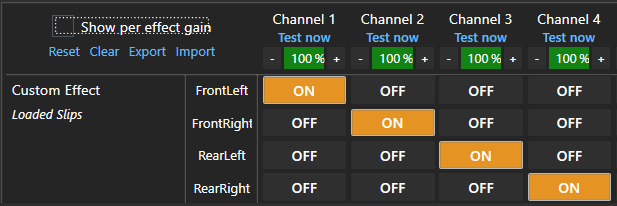
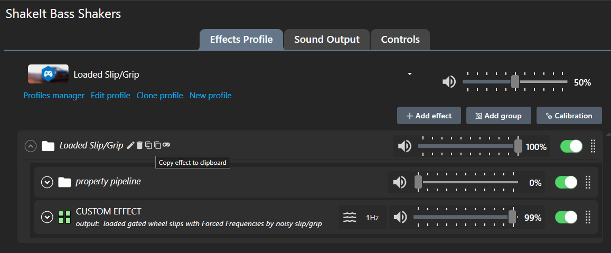

# SimHub profiles
 My SimHub is configured to look for these profiles in `Documents\SimHub\`  
 ShakeIt profiles e.g. for tire slip and Custom Serial profiles e.g. for harness tensioning, etc;&nbsp; mostly NOT dashes  
 For file names differing only by `.txt` suffix, `.txt` version is usually older.
 - `.txt` suffix for posting to [RaceDepartment](https://www.overtake.gg/threads/simhub-shakeit-bass-shakers-custom-4-corner-tire-slip.198455/)  

 Newer versions are not necessarily better;&nbsp; perhaps ongoing or unsuccessful experiments.  

---

## [ShakeIt Bass Shakers - Tactile profiles](https://blekenbleu.github.io/pedals/shakeit.htm)
### Suggested tire slip Shakeit profiles
- [LoadedSlipGrip.siprofile](https://github.com/blekenbleu/SimHub-Profiles/blob/main/LoadedSlipGrip.siprofile)  
	  
	*4 output channels e.g. for seat cushion*  

	  
	*copy* `Loaded Slip/Grip` *effect group to clipboard, then paste into your usual ShakeIt profile*
	- described [here](https://blekenbleu.github.io/pedals/shakeit.htm#S/G); &nbsp; discussed [there](https://www.overtake.gg/threads/simhub-shakeit-bass-shakers-custom-4-corner-tire-slip.198455/page-8)  
- [LoadedSlipGripJSONio.siprofile](https://github.com/blekenbleu/SimHub-Profiles/blob/main/LoadedSlipGripJSONio.siprofile),
	 [currentSlipGripJSONio.siprofile](https://github.com/blekenbleu/SimHub-Profiles/blob/main/currentSlipGripJSONio.siprofile)  
	- [JSONio SimHub plugin](https://github.com/blekenbleu/JSONio) required  
		Slip/grip estimated from SimHub properties wants car-specific tuning; &nbsp;  JSONio helps manage that...

#### [ShakeIt Formulae JavaScript documentation](https://blekenbleu.github.io/pedals/ShakeIt/)  
Some ShakeIt effects preprocess telemetry e.g. for harness tensioning Custom serial devices... 

## Custom serial devices
- [Fake8.shsds](Fake8.shsds) as used in [**SimHub plugin for Direct Drive harness tension control**](https://github.com/blekenbleu/Direct-Drive-harness-tension-tester)
### Stuyo's sim belt servo tensioner  
- [@Wschuck](https://discord.com/channels/299259397060689920/1075603500609839246/1077844957274062888)'s Updated [Seatbelt_tensioner.siprofile](Seatbelt_tensioner.siprofile)
   and [seatbelt_profile_with_shakeit.shsds](seatbelt_profile_with_shakeit.shsds)  
  for use e.g. with [Stuyo's sim belt servo tensioner](https://github.com/blekenbleu/Arduino-Blue-Pill/tree/main/Blue_ASCII_Servo)
  as [described here](https://blekenbleu.github.io/Arduino/Blue_ASCII_Servo/)
#### [Arduino sketches for Custom Serial profiles](https://blekenbleu.github.io/Arduino/SimHubCustomSerial) discussion
#### See [SimHub Custom serial profile atlas](https://blekenbleu.github.io/Arduino/shsds.htm) for details about these:  
   - [tension.shsds](tension.shsds.txt)
   - [running.shsds](running.shsds)
   - [proxy_G.shsds](proxy_G.shsds.txt)
   - [Noticeable.shsds](Noticeable.shsds.txt)
   - [JustNoticeable.shsds](JustNoticeable.shsds)
   - [Devices3messages6.shsds](Devices3messages6.shsds)
   - [UpdatedProxyG.shsds](UpdatedProxyG.shsds)
   - [JND_LUT.shsds](JND_LUT.shsds)
   - [BeltTensionner1705.shsds ](BeltTensionner1705.shsds )
   - [BeltTensionner1605.shsds](BeltTensionner1605.shsds)
   - [new_serial.shsds](new_serial.shsds)
   - [compare.shsds](compare.shsds)
